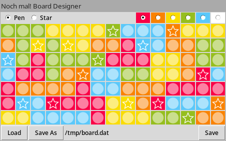

# Noch mal! Tools
This repository aims to provide some tools to check, generate and design a
board for the Game [Noch mal!](https://www.schmidtspiele-shop.de/noch-mal).
The rules for the game can be found [here](https://gesellschaftsspiele.spielen.de/uploads/files/2904/57d9a9568c464.pdf).

 

## Generating a board
The `generateboard.py` script allows to generate a board via backtracking. For reproducible results a seeded random
number generator is used. The algorithm is configurable and the available parameters and their description can be listed
by running `generateboard.py -h`.

### Usage
    generateboard.py [-h] [-s <seed_as_integer>] [-l <limit_as_integer>] [-p] [--line6] [--multiple-comp-per-col] [--order {RFCI,RAND,DESC}] <output-board-file>

### Example
    generateboard.py -p -l 7 --line6 --multiple-comp-per-col --order=DESC board.dat

The above command terminates with only 94 placements and visualizes the generation process (The resulting board does not
fulfil all requirements of a valid board):

## Board designer
With the board designer script it is possible to design and edit a board.

### Dependencies
- tkinter (for the GUI)

### Usage
    boarddesigner.py [<path-to-board-file>]

## Single player challenge
The original game also features a single player challenge in which the player has 30 tosses and has to cross out as many
tiles as possible to achieve a high score. The script `singleplayerchallenge.py` provides a GUI to play this challenge.
It is also possible to load custom boards and play on them.

